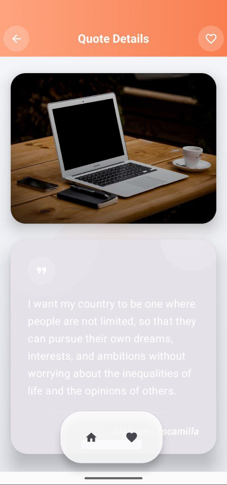
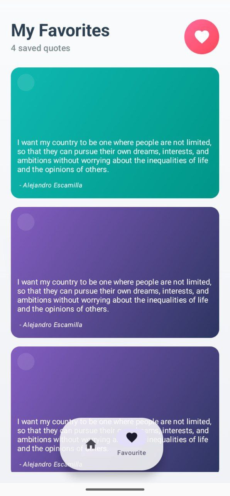
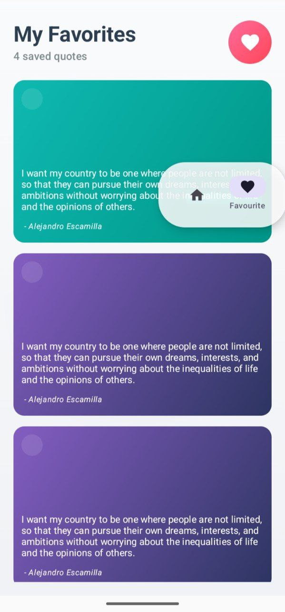

🌟 GreedyGame - Quotes Browser App

A modern Android quotes app built with Jetpack Compose, featuring:

Quotes display with gradient cards

Banner slider for featured content

Favorite quotes management

Persistent storage with DataStore Preferences

Floating, movable navigation bar

📱 Features
Home Screen

Displays a list of quotes in beautiful gradient cards

Banner slider at the top for featured content

Long press on a quote navigates to Detail Screen

Detail Screen

Shows quote text and author

Toggle favorite using a heart icon

Favorites Screen

Displays all quotes marked as favorite

Updates automatically when favorites change

Floating Navigation Bar

Movable and slidable bottom navigation bar

Can be dragged to any position on the screen

Provides quick access to Home and Favorites screens

Data Persistence

Favorites stored using DataStore Preferences (modern replacement for SharedPreferences)

UI updates automatically on change

Navigation

Clean navigation using Navigation Compose

Image Loading

Quote images loaded asynchronously using Coil

🛠️ Technologies Used

Kotlin – Primary language

Jetpack Compose – Modern UI toolkit

DataStore Preferences – Persistent storage for favorite quotes

Coil – Async image loading

Navigation Compose – Screen navigation

Material 3 – Modern Material Design components

⚡ Dependencies
implementation("androidx.compose.material3:material3:1.1.0")
implementation("androidx.navigation:navigation-compose:2.9.6")
implementation("io.coil-kt:coil-compose:3.3.0")
implementation("androidx.datastore:datastore-preferences:1.1.1")
implementation("androidx.compose.material:material-icons-extended:1.7.8")

Full dependencies are managed via Version Catalog (libs.versions.toml)

🔄 How It Works

UI Layer: Composable screens observe Flow from the ViewModel

ViewModel: Fetches quotes and favorite IDs from repository

Repository: Reads/writes favorite quote IDs to DataStore Preferences

DataStore: Persistently stores favorites; UI updates automatically

Floating Navigation Bar: Movable and slidable, providing quick navigation

Acknowledgements: Special thanks to ChatGPT and Claude for guidance in implementing the movable, slidable navigation bar and for helping enhance the code structure and UI design.

### Screenshots

  

    
    
Home Screen

  

  

    
    
Detail Screen

  

  

    
    
Favorites Screen

  

  

    
    
Navigation Bar

  

  

